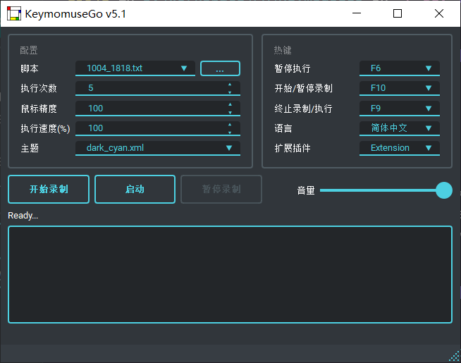

<div align="center">

# ClawMouse

<br>


<div>
    
</div>
<div>
    
    
    
</div>
<br>

[简体中文](README.md) | [English](README_en-US.md)

</div>

ClawMouse 是一个面向桌面自动化的 Python 项目，既能作为传统“录制 / 回放”宏工具使用，也能作为一个可被 AI 代理调用的 MCP 自动化服务使用。

一句话理解：

- 想自动执行一段桌面操作，用它录制和回放
- 想让 AI 操作桌面窗口、聊天框和截图，用它启动 MCP
- 想让 Trae / Lobster 继续处理任务，用它跑 bridge 工作流

如果你准备在 Windows 上长期维护并公开发布这个仓库，建议把项目根目录固定为：

```text
C:\ClawMouse
```

当前建议首发版本为 `v0.1.0`，对应文件：

- `VERSION`
- `Changelog.md`
- `RELEASE.md`

当前仓库已经不只是桌面宏工具，还包含三条可组合的能力链路：

- 桌面录制与脚本回放
- MCP 桌面操作、窗口操作、截图和聊天发送
- 面向 Trae / Lobster / OpenClaw 风格工作流的桥接与委托

## 快速入口

- 想直接上手桌面录制：看“快速开始”
- 想先理解项目分层：看 `docs/PROJECT_MAP.md`
- 想发布 exe 给别人用：看 `docs/WINDOWS_RELEASE.md`
- 想接入 AI / MCP：看 `examples/mcp/`
- 想排查问题：看 `docs/FAQ.md` 和 `docs/TROUBLESHOOTING.md`

## 适合谁

- 普通用户：想把重复点击、输入、切换窗口自动化
- 开发者：想把桌面能力整理成脚本、工具或本地服务
- AI Agent 使用者：想让模型调用窗口、截图、聊天发送与 bridge 工作流

## 项目定位

- 想录一段鼠标键盘操作并重复执行：直接用 GUI 或命令行
- 想让 AI 远程驱动窗口、点击、输入、截图：启动 MCP Server
- 想把 Trae 当成“被委托执行”的桌面 IDE：使用 `trae_status` / `trae_delegate`

## 应用场景

- 重复性桌面操作自动化，例如固定流程点击、输入、切换窗口和截图
- 测试或演示辅助，例如录制一段标准操作并稳定重复回放
- AI 驱动的桌面执行，例如让 MCP Host 代替人工完成窗口交互
- 聊天软件或 IDE 辅助操作，例如向指定聊天窗口发送内容、执行桥接工作流
- 本地代理协作，例如让 Lobster / Trae / OpenClaw 风格代理通过 bridge 继续处理任务

## 核心能力

- 宏录制：录制鼠标点击、键盘输入并保存为 JSON5 脚本
- 脚本执行：支持 GUI、CLI、循环次数、后台执行与中止
- 窗口自动化：窗口查找、聚焦、窗口内点击、拖拽、键盘输入
- 聊天自动化：可配置聊天输入框、发送按钮、点击后回车策略
- 截图能力：整窗、区域、分区图、配置化截图
- MCP 服务：把上述能力以工具形式暴露给 AI
- Trae 桥接：状态检查、任务委托、桥接消息格式化、文件队列

## 仓库结构

- `KeymouseGo.py`：GUI 启动入口，当前保留历史文件名以兼容既有脚本与打包流程
- `ClawMouse.py`：推荐的品牌化启动入口，兼容 GUI 和脚本命令行调用
- `mcp_server.py`：MCP Server 启动入口
- `Util/MCPController.py`：MCP 主要控制器，包含窗口、输入、截图、桥接与 Trae 接口
- `examples/bridge/trae_executor.py`：Trae 任务执行器
- `examples/bridge/trae_task_poller.py`：桥接任务轮询器
- `examples/mcp/`：MCP Host 与 Lobster / OpenClaw 风格示例配置
- `Event/`、`Recorder/`、`Plugin/`：宏录制 / 执行 / 插件相关基础模块
- `assets/`：界面资源与国际化资源

## 项目结构图

如果你想快速看懂这个仓库的能力分层，建议直接看：

- `docs/PROJECT_MAP.md`

## 快速开始

### 1. 作为桌面宏工具使用

```bash
pip install -r requirements-windows.txt
python ClawMouse.py
```

使用流程：

- 点击 `录制`
- 手动执行一遍动作
- 点击 `结束`
- 点击 `启动` 回放

### 2. 作为命令行脚本执行器使用

```bash
python ClawMouse.py scripts/0314_1452.txt
python ClawMouse.py scripts/0314_1452.txt --runtimes 3
```

### 3. 作为 MCP 服务使用

安装依赖：

```bash
pip install -r requirements-mcp.txt
```

使用标准输入输出方式启动：

```bash
python mcp_server.py
```

使用 HTTP 方式启动：

```bash
python mcp_server.py --transport http --host 127.0.0.1 --port 8000
```

### 4. 在桌面版 Trae 中接入 MCP

如果你在 Windows 上按推荐目录使用当前仓库：

```text
C:\ClawMouse
```

并且 Python 环境是：

```text
C:\ProgramData\anaconda3\envs\keymousego310\python.exe
```

那么桌面版 Trae 的 `mcpServers` 配置可以直接写成：

```json
{
  "mcpServers": {
    "clawmouse": {
      "command": "C:\\ProgramData\\anaconda3\\envs\\keymousego310\\python.exe",
      "args": [
        "C:\\ClawMouse\\mcp_server.py"
      ],
      "cwd": "C:\\ClawMouse",
      "env": {
        "PYTHONIOENCODING": "utf-8"
      }
    }
  }
}
```

如果你使用桌面版 Trae 的“编辑 MCP 服务”表单，也可以按下面填写：

- 服务名称：`clawmouse`
- 描述：`clawmouse 桌面控制、截图与聊天消息发送`
- 传输类型：`标准输入输出 (stdio)`
- 命令：`C:\ProgramData\anaconda3\envs\keymousego310\python.exe`
- 参数：`C:\ClawMouse\mcp_server.py`
- 环境变量：`PYTHONIOENCODING=utf-8`
- 如果表单里提供工作目录字段：填写 `C:\ClawMouse`

如果 Trae 提示 JSON 格式错误，优先检查：

- 是否使用了严格 JSON，而不是 JSON5
- Windows 路径是否写成双反斜杠 `\\`
- 最后一项后面是否多了逗号
- 是否把完整对象错误地粘贴进了 `mcpServers` 内部

## MCP 工具分层

### 脚本与执行

- `list_scripts`
- `validate_script`
- `run_script`
- `start_script`
- `stop_execution`
- `get_status`

### 桌面与窗口控制

- `mouse_move`
- `mouse_click`
- `double_click`
- `drag`
- `mouse_scroll`
- `key_down`
- `key_up`
- `key_tap`
- `hotkey`
- `text_input`
- `type_and_enter`
- `list_windows`
- `find_window`
- `focus_window`
- `focus_window_by_title`
- `click_in_window`
- `drag_in_window`

### 聊天与窗口画像

- `send_message_to_window`
- `list_chat_profiles`
- `get_chat_profile`
- `save_chat_profile`
- `reset_chat_profile`
- `inspect_cursor_in_window`
- `calibrate_chat_profile_point`
- `send_message_with_profile`
- `browser_chat_send_message`
- `trae_send_message`
- `trae_solo_send_message`
- `wechat_send_message`
- `qq_send_message`

### 截图与视觉辅助

- `capture_window`
- `capture_window_region`
- `capture_window_partition_map`
- `list_screenshot_profiles`
- `capture_profile_window`
- `capture_profile_region`
- `capture_profile_partition_map`

### 文件桥接

- `get_bridge_status`
- `send_bridge_task`
- `list_bridge_tasks`
- `list_bridge_replies`
- `read_bridge_reply`
- `wait_bridge_reply`
- `write_bridge_reply`
- `claim_bridge_task`
- `archive_bridge_task`

### TraeClaw 风格高层接口

- `trae_status`
- `trae_delegate`
- `build_trae_bridge_prompt`
- `trae_send_bridge_message`

这组接口的目标是把复杂的窗口发送、桥接任务、Trae 健康检查收敛成更稳定的上层调用方式。

## Trae 桥接工作流

如果你想让另一个 AI 通过当前桌面 Trae 继续工作，建议按下面顺序使用：

1. 调 `trae_status`，确认窗口已就绪、poller 正在运行
2. 调 `trae_delegate(mode='bridge_task')`，把任务写入 bridge 队列
3. 或调 `trae_delegate(mode='window_message')`，直接向当前 Trae 窗口发送消息
4. 结合 `wait_bridge_reply` / `read_bridge_reply` 读取桥接结果

相关示例：

- `examples/bridge/lobster_bridge_workflow.md`
- `examples/mcp/lobster.example.json5`
- `examples/mcp/mcpServers.example.json`

## 开发与打包

### 本地运行

```bash
pip install -r requirements-windows.txt
pip install -r requirements-mcp.txt
python ClawMouse.py
```

### 打包为可执行文件

```bash
pip install pyinstaller
pyinstaller -F -w --add-data "./assets;assets" ClawMouse.py
```

Linux / macOS 平台的打包命令保留在旧版本 README 的思路中，如需恢复可继续沿用原有 `pynput` hidden-import 配置。

### Windows 单文件发布

如果你想给普通用户直接提供 exe，建议使用仓库内置脚本：

```powershell
powershell -NoProfile -ExecutionPolicy Bypass -File .\scripts\build-release.ps1
```

默认会在 `release/` 目录生成：

```text
ClawMouse-v0.1.0-win.exe
```

更完整的打包与分发说明见 `docs/WINDOWS_RELEASE.md`。

## 脚本格式

脚本使用 JSON5 保存，每个最内层对象代表一个事件：

```json5
{
  scripts: [
    {type: "event", event_type: "EM", delay: 3000, action_type: "mouse right down", action: ["0.05208%", "0.1852%"]},
    {type: "event", event_type: "EM", delay: 50, action_type: "mouse right up", action: [-1, -1]},
    {type: "event", event_type: "EK", delay: 1000, action_type: "key down", action: [70, "F", 0]},
    {type: "event", event_type: "EK", delay: 50, action_type: "key up", action: [70, "F", 0]},
    {type: "event", event_type: "EX", delay: 100, action_type: "input", action: "你好 world"}
  ]
}
```

更多说明建议参考后续补充的架构文档与示例工作流。

## 开源整理说明

为了让仓库更适合公开共享，当前版本的整理原则是：

- 运行时数据不进入版本控制，例如 `screenshots/`、`ai_bridge/`、临时任务目录
- 桥接接口优先提供稳定的高层入口，而不是要求调用方直接拼底层动作
- 示例配置放在 `examples/`，运行期产物放在忽略目录里

## 借鉴与致谢

- ClawMouse 在能力与代码组织上借鉴并延续了 `KeymouseGo` 的基础思路
- 感谢原项目作者 `taojy123` 以及历史贡献者提供的开源基础、桌面宏能力和长期维护经验
- 当前仓库是在原有桌面自动化能力之上，继续向 MCP、截图、窗口控制和 Trae bridge 工作流方向整理与扩展

## 贡献

欢迎提交 Issue 和 Pull Request。

建议优先关注以下方向：

- 回复提取稳定性
- 跨平台兼容性
- MCP 工具文档和示例
- Trae / OpenClaw 风格桥接工作流

详细贡献方式见 `CONTRIBUTING.md`，整体架构见 `docs/ARCHITECTURE.md`。

发布与分发可参考：

- `RELEASE.md`
- `docs/PROJECT_MAP.md`
- `docs/WINDOWS_RELEASE.md`
- `docs/REPOSITORY_SETUP.md`
- `docs/FAQ.md`
- `docs/TROUBLESHOOTING.md`

## 许可证

本项目使用仓库中的 `LICENSE`。
