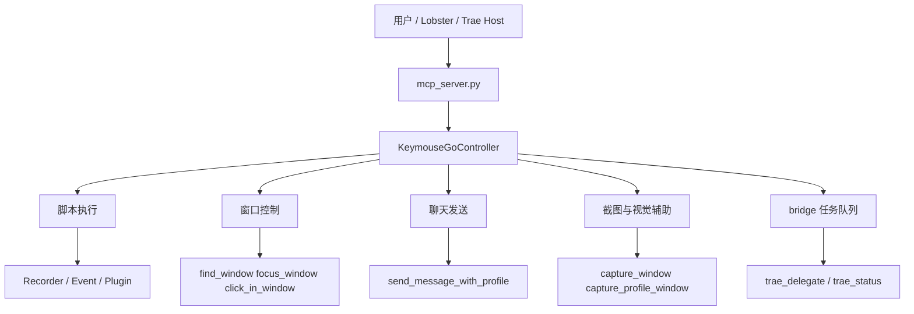
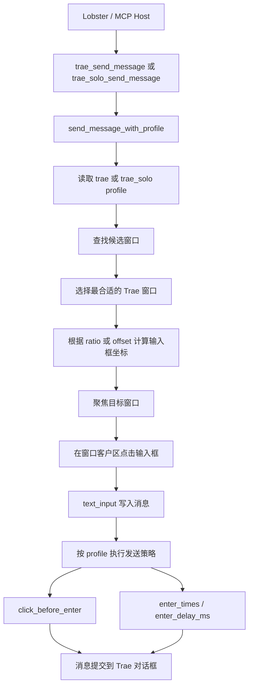

# 架构概览

ClawMouse 当前可以理解成三层能力叠加：

- 宏录制与脚本执行层
- MCP 桌面自动化层
- Trae 桥接与委托层

## 1. 宏录制与脚本执行层

这部分是项目的传统能力。

### 主要模块

- `Recorder/`
- `Event/`
- `Plugin/`
- `KeymouseGo.py`

### 作用

- 录制鼠标点击和键盘输入
- 保存为 JSON5 脚本
- 在 GUI 或 CLI 中重复执行

## 2. MCP 桌面自动化层

这部分把项目能力暴露给外部 AI 或自动化编排系统。

### 主要入口

- `mcp_server.py`
- `Util/MCPController.py`

### 能力分组

- 桌面输入：鼠标、键盘、文本输入
- 窗口控制：查找、聚焦、窗口内点击和拖拽
- 聊天画像：输入框、发送按钮、点击后回车策略
- 截图能力：整窗、区域、分区图
- 文件桥接：任务队列、回复队列、归档

## 3. Trae 桥接与委托层

这部分是最近整理出来的高层接口，目标是借鉴 TraeClaw 的思路，把复杂的调用流程收敛成更稳定的上层能力。

### 核心接口

- `trae_status`
- `trae_delegate`
- `build_trae_bridge_prompt`
- `trae_send_bridge_message`

### 设计目标

- 先做健康检查，再发任务
- 让调用方少碰底层窗口细节
- 把 bridge_task 和 window_message 两种模式统一在一个入口下

## 4. bridge 工作流

桥接目录默认由下面几个部分组成：

- `tasks/`
- `replies/`
- `archive/tasks/`
- `archive/replies/`

### 典型流程

1. 调用方写入任务
2. poller 领取任务并标记为 processing
3. 执行器决定如何处理任务
4. 结果写回 replies
5. 任务与回复归档

## 5. 执行器与 poller 的关系

### poller

文件：

- `examples/bridge/trae_task_poller.py`

职责：

- 轮询任务目录
- 领取待处理任务
- 调用执行器
- 写回 reply
- 归档任务

### executor

文件：

- `examples/bridge/trae_executor.py`

职责：

- 根据模式执行任务
- 当前重点模式是 `window_chat`
- 在窗口模式下先调用 `trae_status`
- 再通过 `trae_delegate(mode='window_message')` 发送到 Trae
- 再尝试从可见聊天区域抽取回复

## 6. 功能流程图

### 总体能力流

### Lobster 无扰动发送到 Trae 对话框

这个链路的目标不是“盲点屏幕坐标”，而是尽量基于窗口识别、画像坐标和输入策略，把消息稳定送到 Trae 对话框。

### 为什么这条链路更稳

- 先找窗口，再算窗口内偏移，而不是直接用固定屏幕坐标
- `trae` 和 `trae_solo` 分别维护 profile，避免桌面版和网页版混用同一套发送参数
- 发送前先聚焦目标窗口，再在窗口客户区点击输入框，减少误发到别的窗口
- 发送动作支持 `click_before_enter`、`enter_times`、`enter_delay_ms`，能适配富文本输入框和网页聊天框
- 当同时存在桌面版 Trae 和网页版 Trae Solo 时，会优先选择更符合当前 profile 的窗口

## 7. 当前已知边界

### 已相对稳定

- 窗口定位
- 输入框发送
- 点击后回车发送策略
- MCP 高层接口组织

### 仍在持续优化

- 从 Trae 可见聊天区域稳定提取回复
- OCR 噪声过滤
- processing / tmp 残留文件自愈
- 更强的桥接恢复能力

## 8. 建议的二次开发方向

如果要在这个仓库上继续扩展，建议优先沿以下方向推进：

- 继续把零散能力收敛到高层接口
- 为 `trae_status` 增加更完整的健康检查
- 为 `trae_delegate` 增加重试、超时和回执策略
- 给 bridge 队列加入恢复和自愈逻辑
- 补齐针对 OpenClaw / Lobster 的更稳定示例
